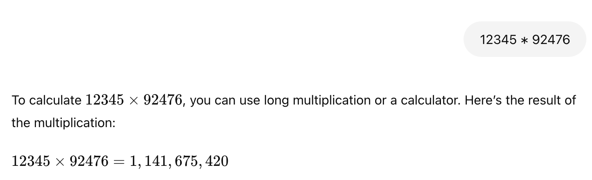

Despite significant advancements, Large Language
Models (LLMs) still exhibit limitations in their
arithmetic capabilities. These models, while adept
at generalizing to various tasks like document ex-
traction and QA, often struggle with performing
accurate mathematical calculations, especially be-
yond basic arithmetic. This deficiency arises due
to the inherent nature of LLMs, which are trained
primarily on textual data, rather than on specialized
mathematical problems or algorithms. As a result,
their mathematical reasoning is often error-prone,
limiting their utility in tasks that require precise
numerical computations.

ChatGPT’s failure to multiply two 5 digit
numbers

We are integrating an Arithmetic Logic Unit inside the transformer blocks used by LLMs and finetuning them to allow
LLMs to compute solutions to arithmetic problems efficiently and correctly.