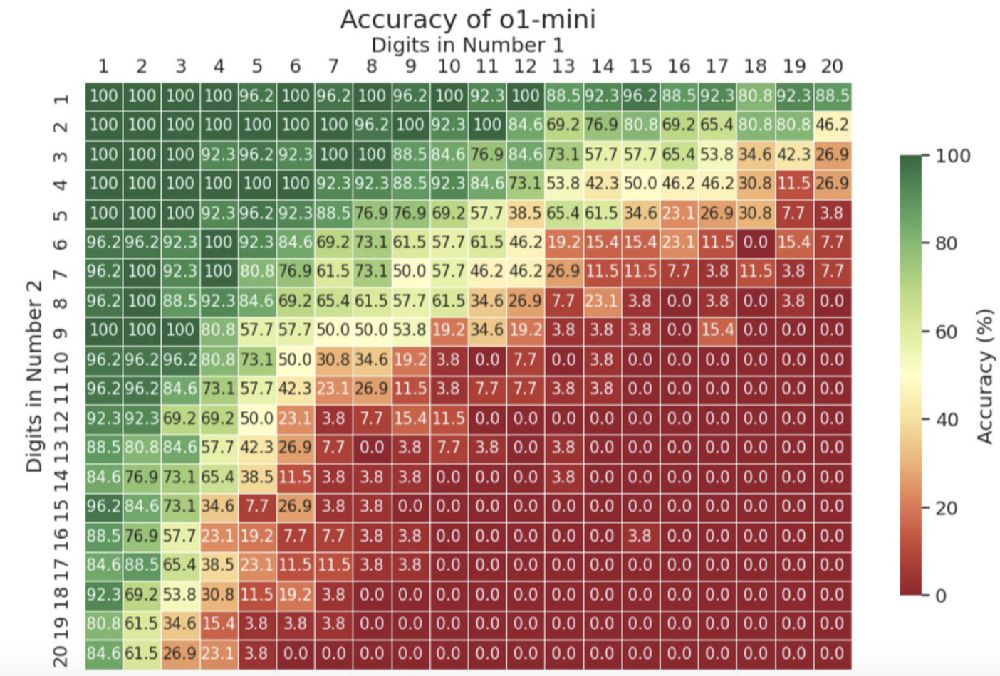
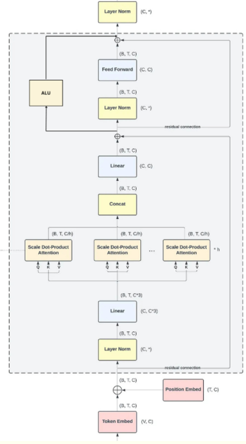
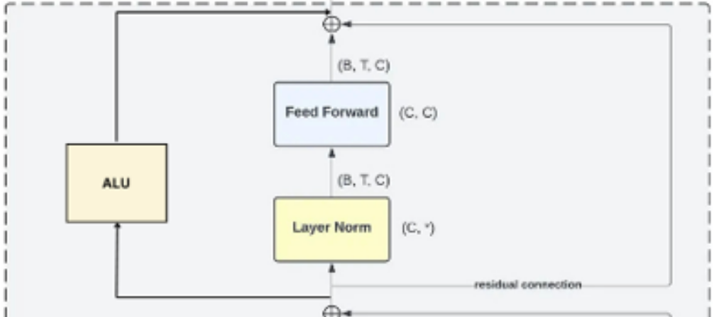
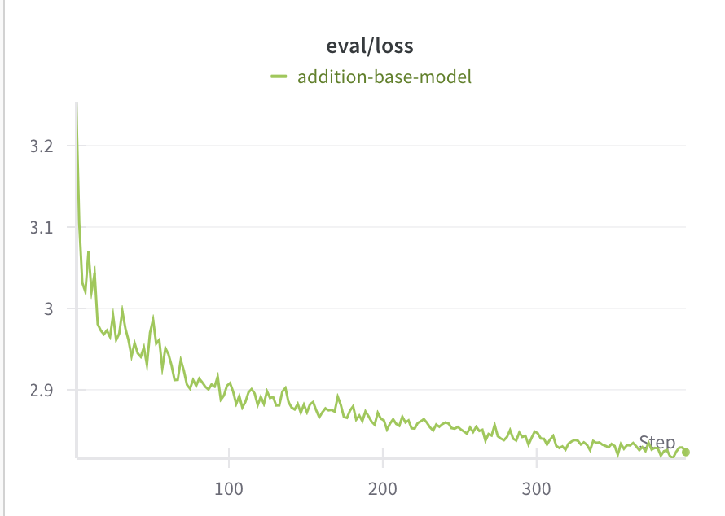

# Introduction
Despite significant advancements, Large Language
Models (LLMs) still exhibit limitations in their
arithmetic capabilities. These models, while adept
at generalizing to various tasks like document extraction and QA, often struggle with performing
accurate mathematical calculations, especially beyond basic arithmetic. This deficiency arises due
to the inherent nature of LLMs, which are trained
primarily on textual data, rather than on specialized
mathematical problems or algorithms. As a result,
their mathematical reasoning is often error-prone,
limiting their utility in tasks that require precise
numerical computations.

------------------

###### ChatGPT’s failure to multiply two 5 digit numbers

###### Performance of o1 model on multiplications

## Methodology

We are integrating an Arithmetic Logic Unit within the transformer block and fine-tuning LLMs to enable efficient and accurate computation of solutions to arithmetic problems.

We integrated our ALU layer with the last 3 decoder blocks of GPT-2 model. The ALU computation was performed using the values obtained after the first residual connection, and the output of the ALU was inserted at the end of the decoder. This can be seen in the Figure below:

Zoomed in: 

## Results

We see final loss of less than 2.8 for addition operations after 10000 epoch with batch size 32.

